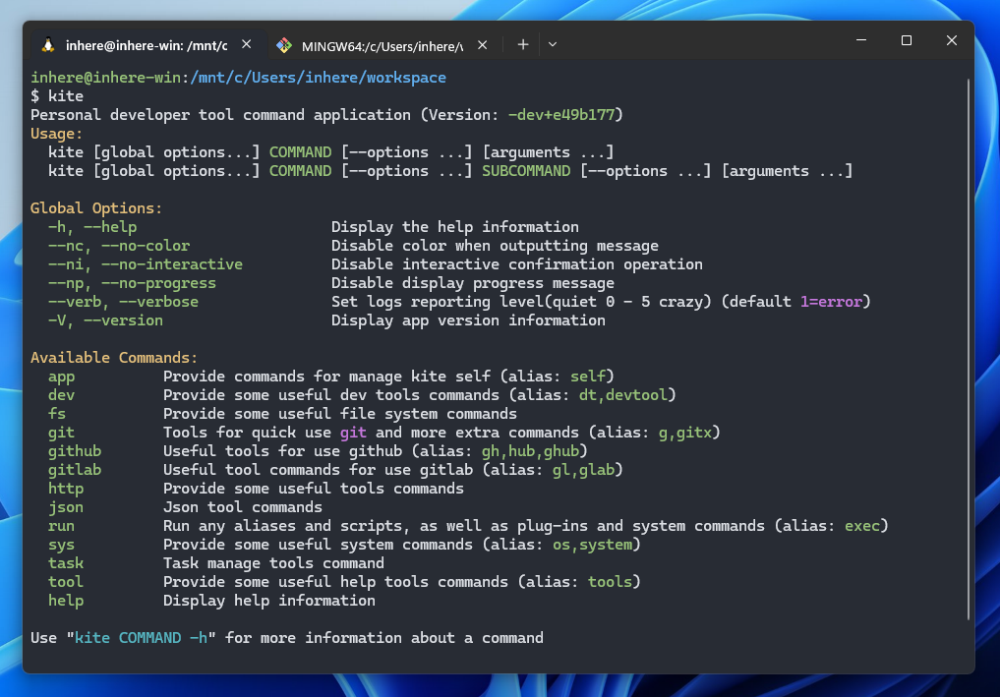

# Kite

`kite` - Personal developer tool command application.



## Git 仓库

* [https://github.com/inhere/kite](https://github.com/inhere/kite)  PHP 版本，功能较为完善，已开发使用较久。
* [https://github.com/inhere/kite-go](https://github.com/inhere/kite-go) Go 语言版本，暂时只有常用功能。

## 主要功能

* git 常用命令操作
* gitlab 常用命令操作
* github 常用命令操作
* 字符串处理工具: 分析，格式化，提取信息，转换
* json 处理工具: 格式化，查找，过滤等
* go, php, java 代码生成，转换等
* json, yaml, sql 格式化，转换
* 系统、环境信息查看
* 快速运行内置脚本
* 快速运行系统命令
* 文件查找匹配，处理
* 批量运行命令
* 文档搜索、查看等

## 安装

### 快速安装

```bash
curl https://raw.githubusercontent.com/inhere/kite-go/main/cmd/install.sh | bash
```

**从代理下载安装脚本**

```shell
curl https://ghproxy.com/https://raw.githubusercontent.com/inhere/kite-go/main/cmd/install.sh | bash -s proxy
```

### 从 Releases 下载

```shell
wget -c https://github.com/inhere/kite-ge/releases/latest/download/kite-{OS}-{ARCH}.tar.gz
```

### 通过GO安装

```bash
go install github.com/inhere/kite-go/cmd/kite
```

### 初始化

- 下载完成后,将解压后的可执行文件移动到 `PATH` 目录下,注意设置执行权限
- 运行 `kite app init` 执行初始化. 会生成默认的配置文件等到 `~/.kite-go` 目录

```shell
$ kite app init
```

------

## 开始使用

```shell
kite # 查看全部命令
kite COMMAND # 运行一个命令
kite COMMAND -h # 查看命令帮助信息
kite COMMAND SUBCOMMAND # 运行一个子级命令
```

### 配置Shell命令别名

推荐配置常用命令组别名到 `~/.bashrc` 或者 `~/.zshrc`，这样可以快速使用常用的命令。

```bash
## aliases for kite
# NOTICE: zsh plugin support add aliases
alias kg="kite git"
alias kgl="kite gitlab"
alias kgh="kite github"
alias kj="kite json"
alias kstr="kite text"
```

## Git 命令使用

`kite git` 提供了一些 git 命令行快速使用命令的封装.

```shell
$ kite g # 查看封装的可用的 git 命令
```

> TIP: 通过 `kite git CMD` 运行未知命令会自动转发到系统上的 `git` 下面执行. 因此, 可以执行任何 `git` 命令.

## Gitlab 命令使用

`kite gitlab` 提供了一些 gitlab 命令行快速使用命令的封装.

```shell
$ kite gl # 查看封装的可用的 gitlab 命令
```

> TIP: 通过 `kite gl CMD` 运行未知命令会自动转发到 `kite git` 命令组下面执行. 因此, 可以执行任何 git 命令.

### 配置Gitlab

通常只需要配置下面两个信息即可使用

```dotenv
# gitlab host，不带 http 协议前缀
GITLAB_HOST=gitlab.your.com
# fork 模式下，源仓库的 remote 名称
GITLAB_SRC_REMOTE=main
```

### 快速克隆仓库

可用直接使用 `group/path` 快速克隆仓库, 会自动填充配置的 `GITLAB_HOST` 进行克隆.

```shell
$ kite gl clone group/path
```

### 快速提交信息

`kite gl ac` 快速提交:

```shell
$ kite gl ac -m "fix: fix a bug"
```

`kite gl acp` 快速提交并推送:

```shell
$ kite gl acp -m "fix: fix a bug"
```

### Fork开发模式

通过配置 `config/gitx.yml` 中的 `fork_mode: true` 开启 fork 模式.

```yaml
gitlab:
  fork_mode: true
```

> TIP: gitlab 的配置默认会继承 `gitx.yml->git` 的配置信息.

### 其他gitlab命令

```shell
$ kite gl open # 快速在浏览器打开当前仓库
```

## GitHub 命令使用

GitHub 大部分命令与 `git` `gitlab` 组下面的相同. 同样提供了 `ac` `acp` `clone` `open` 等命令.

> TIP: 通过 `kite gh CMD` 运行未知命令会自动转发到 `kite git` 命令组下面执行.

### 配置

通常只需要配置下面de信息即可使用

```dotenv
# github
GITHUB_USER=inhere
```

> TIP: `github` 的配置默认会继承 `gitx.yml->git` 的配置信息.

### 快速克隆仓库

可用直接使用 `group/path` 快速克隆仓库, 会自动填充配置的 `GITLAB_HOST` 进行克隆.

```shell
$ kite gl clone group/path
```

## Http 工具使用

### 启动一个简单的echo服务

启动一个简单的 `echo` 服务用于快速测试发送请求是否正确响应. 不论请求任何路由,都会返回请求的方法,headers,请求数据等.

```shell
$ kite http echo-server
```

### 启动一个文件服务

在指定目录快速启动一个文件服务, 用于测试请求服务文件,比如 图片.

```shell
# file: public/some.png
# access http://localhost:8090/fs/some.png
$ kite http fs-server --port 8090 -w public
```

### 通过模板快速发送请求

通过定义API请求模板和设置请求变量来快速发送请求. 快速实现操作三方工具.

```shell
$ kite http tpl-send -d jenkins --api api-build.json5 -e dev --var branch=qa -v group=my -v repoName=user
```

配置模板信息和目录.

```yaml
# domain: gitlab, jenkins, feishu
http_tpl:
  domains:
    gitlab:
      config_file: $data/http_tpl/gitlab-domain.json5
    jenkins:
      config_file: $data/http_tpl/jenkins-domain.json5
```

## `fs` 文件/目录命令组

`kite fs` 封装了一些对文件或目录的常用操作命令.

### 查看文件内容

`kite fs cat` 跟系统的 cat 类似, 但是会针对不同扩展文件提供语法高亮渲染并输出.

```shell
$ kite fs cat README.md
```

### 渲染模板文件

`kite fs render` 可以通过输入变量或指定变量文件,快速的将模板内容或文件渲染并输出.

**两种引擎模式**:

- `simple/replace`  快速替换模板变量,简单方便,但是不支持表达式.
- `go/go-tpl`  使用 go `text/template` 渲染模板,功能强大.

```shell
# simple example
$ kite fs render -v name=inhere -v age=234 'hi, {{name}}, age is {{ age }}'

# go-tpl example
$ kite fs render --eng go-tpl -v name=inhere -v age=234 'hi, {{.name}}, age is {{ .age }}'

# use variable file and template file
$ kite fs render --var-file /path/to/_variables.yaml @/path/to/my-template.tpl
```

## Kite 信息查看

在 `kite app` 命令下内置了一些命令,可以查看kite自身的信息.

- `kite app init` 初始化kite配置目录和默默配置信息

### 查看基本信息

```shell
$ kite app info
```

可以方便的查看kite的基本信息

- kite版本, 编译的go版本
- 加载的 dotenv 文件
- 加载的配置文件列表
- 配置文件目录等

### 查看内置命令别名

使用kite别名可以快速运行一些常用子命令. `kite app alias` 可以方便的查看配置的 kite 内置命令别名列表. 

> 可以直接运行 `kite env`, 就是因为配置了别名 `env: sys env`. `kite env` 等同于在执行 `kite sys env`

```shell
$ kite app alias -l
```

### 查看详细配置信息

通过 `kite app config` 可以查看加载合并后的全部配置信息,也可以按key查看指定的配置信息.

```shell
$ kite app config -a
```

查看指定key:

```shell
$ kite app config git
$ kite app config gitlab
```

### 查看kite的路径信息

通过 `kite app path` 命令可以查看获取kite的路径信息, 例如: 配置目录,临时目录,缓存目录等等

```shell
$ kite app path -a # 列出所有kite相关的目录信息
$ kite app path base # 获取kite基础目录
$ kite app path config # 获取配置目录
```

### 列出自定义路径别名

`kite app pathmap` 查看用户自定义的快速路径别名列表.

```shell
$ kite app pathmap
```

### 列出kite所有命令

按层级列出kite所有命令,包含所有子级命令列表. TODO

```shell
kite app cmd-map
```

## 运行任意命令或脚本

使用 `kite run COMMAND` 运行任意命令. 它会自动尝试检查 `COMMAND` 是
否是 `alias|script|plugin|system-cmd` 中的一个命令. 匹配成功则执行.

```shell
$ kite run {script|alias|plugin|system-cmd}
```

## 使用并运行脚本

kite 里 `script` 分两种,一种是配置的 一条或多条命令;一种是脚本文件(如 bash 文件).

查看所有的 `scripts` 命令:

```shell
$ kite run --script -l
# 或者(配置了内置别名 script: run --script)
$ kite script -l
```

> TIP: 你可以自定义配置任意的 `scripts` 命令, 请查看 `$config/module/scripts.yml`

### 运行定义脚本

### 运行脚本文件

## sys 系统命令组

`kite sys` 系统命令组提供了一些常用的系统命令包装,方便查询或操作系统工具.

### 在子目录或多个目录同时执行命令

`batch-run` 可以在一个目录的每个子目录或指定的多个目录同时执行命令 TODO 

```shell
$ kite sys batch-run
```

### 读取或写入系统剪切板

`kite sys clip` 可以方便的通过命令方式读取或写入内容到系统剪切板.

```shell
$ kite sys clip -r # read contents
$ kite sys clip -w "some contents" # read contents
```

> TIP: 你会发现在 kite 里很多操作 `字符串` 或者 `文件` 的命令都支持读取剪切板数据.

### 搜索查找可执行文件

`kite sys find-exe` 将会在 PATH 的目录里模糊匹配搜索可执行文件列表.

### 指定查找可执行文件

`kite sys which` 跟系统的 `whereis` `which` 一样将会在 PATH 的目录里完全匹配查找可执行文件.

### 查看ENV环境信息

显示全部环境变量信息：

```bash
kite sys env
# or
# 因为配置了kite别名 env: sys env, 因此可以直接运行 kite env
kite env
```

搜索ENV变量信息:

```shell
$ kite env -s term
```

展开ENV变量信息:

> `--expand` 将会把变量值按系统分隔符分割为多行方便查看.

```shell
$ kite sys env --expand path
```

## 常用工具命令

### 运行命令时自动设置代理环境

可以配置在运行一些特殊命令时自动设置代理环境,方便使用.

配置示例:

```yaml
# will set local_proxy before run matched command
proxy_cmd:
  command_ids:
    - 'github:tag:delete'
  group_limits:
    github: [acp, push, pull, update, update-push]

# local proxy hosts
local_proxy:
  # export http_proxy=http://127.0.0.1:1081;export https_proxy=http://127.0.0.1:1081;
  http_proxy: ${PROXY_SERVE}
  https_proxy: ${PROXY_SERVE}

```

------

## 开发

### Dev build

```shell
KITE_INIT_LOG=debug go run ./cmd/kite
```

### Install to GOBIN

```bash
make install
# or
go build -o $GOPAHT/bin/kite ./cmd/kite
```

## Gookit Packages

- https://github.com/gookit/config
- https://github.com/gookit/rux
- https://github.com/gookit/gcli
- https://github.com/gookit/ini

## Refers

- https://github.com/bitfield/script
- https://github.com/zyedidia/eget Easily install prebuilt binaries from GitHub.
