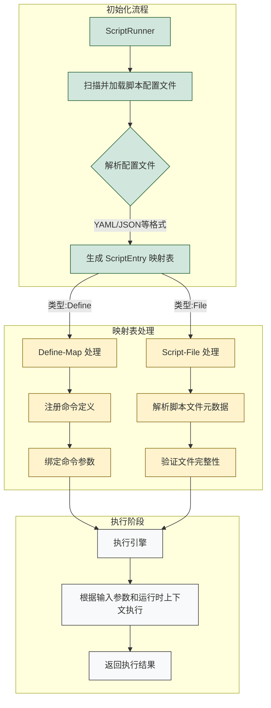

# KScript

- run a script by defining map data.
- run a script file by input arguments.

## DEV

```text
   ScriptRunner
        |
        | scan and load script config files. eg: yaml
        |
   ScriptEntry map
        |
   -----|---------
   |		     |
   |		     |
Script-Task    Script-File
   |               |
Commands        Script file info
   |               |
   |               |
    \           /
   Run by input and context
```


